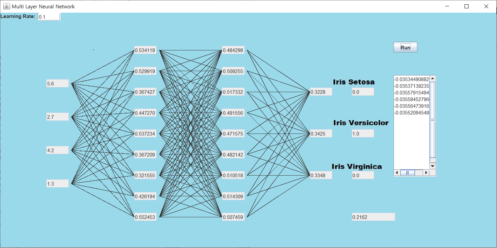

# Simple-Neural-Network-Algorithm

JAVA로 구현한 간단한 DNN 인공신경망입니다.
A simple java neural network algorithm with a simple UI. Try it!

## 사용법
-	좌측 상단에서 Learning Rate 조정
-	Run 버튼을 누르면 정해진 경로의 text파일에서 데이터를 한줄씩 가져옴
-	맨 왼쪽부터 input layer - hidden layer1 - hidden layer2 - output layer, 실제값, 가중치 변화창
-	아래의 수치는 MSE(Mean Squared Error) 값
-	원하는 가중치의 변화를 보고싶다면 NeuralNetwork.java 파일에서 298번째 line의 값을 수정한다. 
